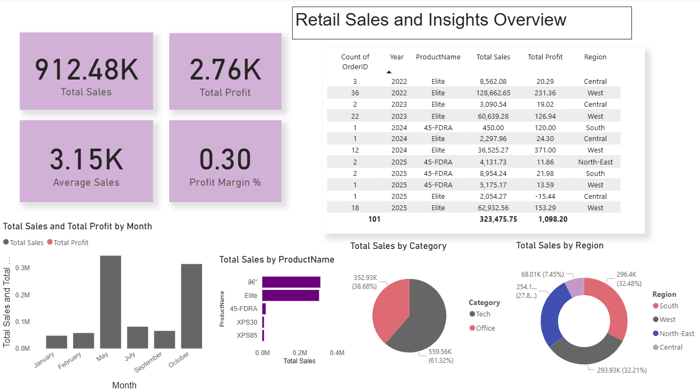

# Retail Sales Dashboard – Power BI

## 📊 Project Overview
This project presents an **interactive Power BI dashboard** built using a retail sales dataset containing order-level details such as product categories, brands, regions, sales, and profits.  
The dashboard delivers **key business insights** to help decision-makers track performance, identify top-performing products, and analyze regional trends.

The dataset contains **250+ sales records** with 9 columns:
- **OrderID**
- **OrderDate**
- **Category**
- **Subcategory**
- **Brand**
- **ProductName**
- **Sales**
- **Profit**
- **Region**

---

## 🎯 Objectives
The primary goals of this project are to:
1. Track **overall sales performance** and profitability.
2. Identify **top-selling products** and regions.
3. Provide **KPI summaries** for quick decision-making.
4. Enable **dynamic filtering** by category, region, and date.
5. Visualize sales and profit trends over time.

---

## 📈 Key Performance Indicators (KPIs)
- **Total Sales**
- **Total Profit**
- **Profit Margin %**
- **Average Sales per Order**

---

## 📊 Dashboard Features
1. **KPI Cards**
   - Total Sales
   - Total Profit
   - Profit Margin %
2. **Sales Trend Over Time**
   - Line chart showing sales and profit by month.
3. **Category & Regional Analysis**
   - Sales by Category (bar chart)
   - Sales by Region (donut chart)
4. **Top Products**
   - Top 10 products by sales (bar chart with filters).
5. **Interactive Filters**
   - Date range slicer
   - Category slicer
   - Region slicer
6. **Detailed Table View**
   - Drill-down view of orders with all attributes.

---

## 🛠 Tools & Technologies
- **Power BI Desktop** – Data visualization and dashboard building.
- **Power Query** – Data cleaning and transformation.
- **DAX (Data Analysis Expressions)** – Custom KPIs and calculated measures.
- **CSV Dataset** – Source data for analysis.

---

## 📷 Dashboard Preview

